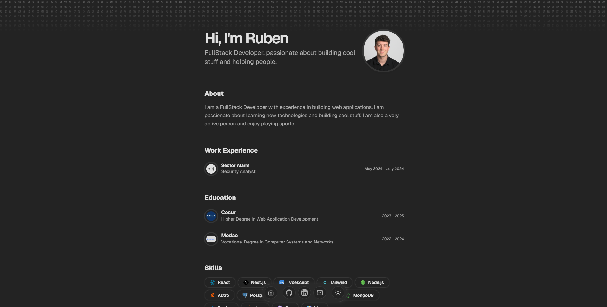

<div align="center">
   <h1>Portfolio</h1>

</div>

# [See the live demo](https://rubentorres.vercel.app)

# Features

- Setup only takes a few minutes by editing the [single config file](./src/data/resume.tsx)
- Built using Next.js 14, React, Typescript, Shadcn/UI, TailwindCSS, Framer Motion, Magic UI
- Responsive for different devices
- Optimized for Next.js and Vercel

# Getting Started Locally

1. Clone this repository to your local machine:

   ```bash
   git clone https://github.com/n3brrr/portfolio
   ```

2. Move to the cloned directory

   ```bash
   cd portfolio
   ```

3. Install dependencies:

   ```bash
   pnpm install
   ```

4. Start the local Server:

   ```bash
   pnpm dev
   ```

# License

Licensed under the [MIT license](https://github.com/n3brrr/portfolio/blob/main/LICENSE.md).

<div align="center">
⭐ Star this repo if you find it useful
</div>
